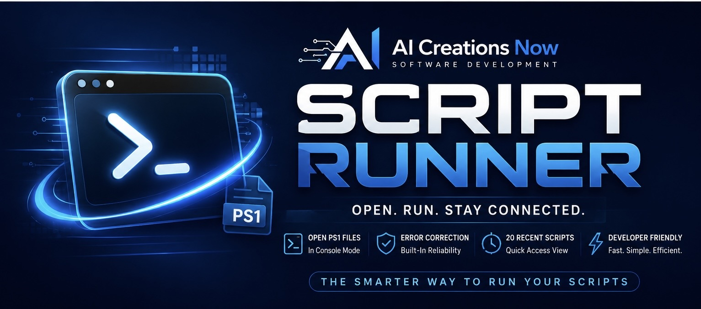
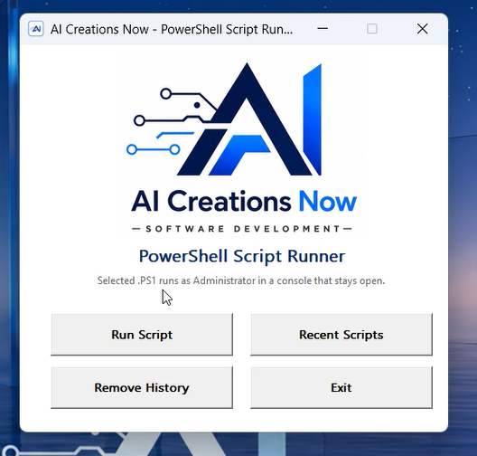
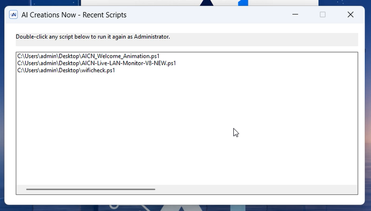

<p align="center">
  <a href="https://aicreatenow.com/scriptrunner.html">
    
  </a>
</p>

<h1 align="center">PowerShell Script Runner</h1>

A free, signed, portable Windows utility from **AI Creations Now Software Development**. Select a local PowerShell `.ps1` file, launch it as Administrator in a console that stays open, and return to your 20 most recently launched scripts. Script Runner handles launching and keeps output visible; it does not repair or debug script code.

<p align="center">
  <a href="https://aicreatenow.com/scriptrunner.html">Official product page</a> · <a href="https://download.aicreatenow.com/software/AICNowSCriptRunnerSigned.exe"><strong>Download free for Windows</strong></a> · <a href="https://download.aicreatenow.com/media/aicreatenow/scriptrunner4k.mp4">Video walkthrough</a>
</p>

<p align="center">
  
</p>

## Features

- Select a local `.ps1` file with the standard Windows file picker.
- Launch the selected script in an elevated Windows PowerShell process.
- Keep the console open with `-NoExit` so output and errors remain visible after execution.
- Reopen scripts by double-clicking entries in **Recent Scripts**.
- Retain up to 20 successfully launched script paths locally.
- Clear the stored list with **Remove History**.

Script Runner is designed for students, junior developers, occasional PowerShell users, and people working with AI-assisted scripts who want a repeatable launch workflow.

<p align="center">
  
</p>

## Requirements

- 64-bit Windows 11 or Windows Server with Desktop Experience.
- Permission to approve or receive Administrator elevation.
- A local PowerShell script you trust.
- Any modules, files, services, or network access required by that script.

## Download and use

1. Download [AICNowSCriptRunnerSigned.exe](https://download.aicreatenow.com/software/AICNowSCriptRunnerSigned.exe) from the official download host.
2. Open the portable application and approve Administrator elevation when requested.
3. Select a local `.ps1` file and launch it.
4. Read the output in the console, which remains open after the script finishes.
5. Use **Recent Scripts** to launch it again, or **Remove History** to clear the list.

**Published version: 1.1.0.** No product installer, trial, subscription, license code, account, or payment is required. Every feature is available without a trial deadline.

## Execution and local data

The selected script runs with `-ExecutionPolicy Bypass` for that PowerShell process only; Script Runner does not permanently change the computer's execution policy. Administrator access gives a script broad control of Windows, so review the script before running it.

Recent script paths are stored locally at:

```text
C:\ProgramData\ScriptRunner\Config\RecentScripts.txt
```

Script Runner does not upload selected scripts to AI Creations Now. It is a launcher: it does not generate, repair, debug, certify, or scan scripts for malicious commands. Each script remains responsible for its own requirements and behavior.

## Support

See [Support](SUPPORT.md) for product help or contact [info@aicreatenow.com](mailto:info@aicreatenow.com). The [product page](https://aicreatenow.com/scriptrunner.html) describes ongoing product updates and lifetime customer support.

[Optional support through Stripe](https://buy.stripe.com/14A3cx63V00MfMEcoe5kk07) helps fund updates and support. Payment is voluntary and does not unlock features. These payments support a commercial software product and are not charitable or tax-deductible donations.

## Practical guide and release notes

[Getting started and common questions](GETTING-STARTED.md) · [GitHub release notes](https://github.com/aicreatenowdom/powershell-script-runner/releases) · [Support](SUPPORT.md)

GitHub's **Code → Download ZIP** contains this repository's documentation and artwork. Get the Windows application through the [official product page](https://aicreatenow.com/scriptrunner.html).

## Source and licensing

This repository contains documentation for proprietary software. Application source code is not included. Obtain the application and its applicable terms through the official product page.
